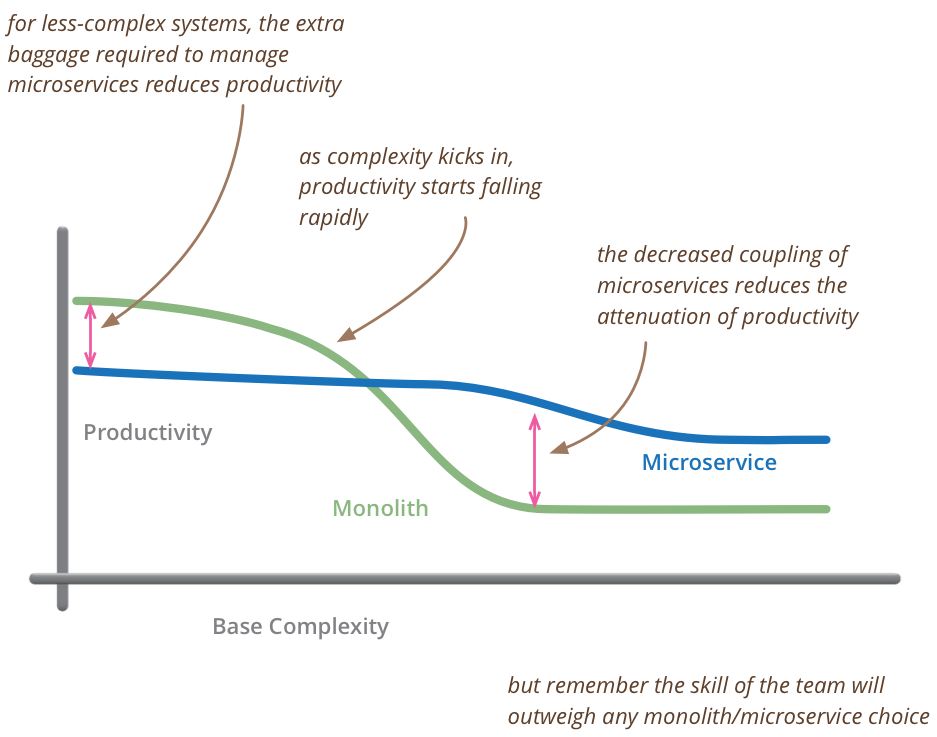

### Microservices

Microservices are small, autonomous services that work together.

---

#### Small, and Focused on Doing One Thing Well

* Cohesion—the drive to have related code grouped together—is an important concept when we think about microservices.
* Single responsibility principle.
* Fit in your head.
* The smaller the service, the more you maximize the benefits and downsides of microservice architecture.

---

#### Autonomous

* Every microservice is a separate entity.
* All communication between the services themselves are via network calls.
* The service exposes an application programming interface (API), and collaborating services communicate with us via those APIs.
* The golden rule: can you make a change to a service and deploy it by itself without changing anything else.

---

### Benefits

---

#### Strong Module Boundaries

Microservices reinforce modular structure, which is particularly important for larger teams.

#### Independent Deployment

Simple services are easier to deploy, and since they are autonomous, are less likely to cause system failures when they go wrong.

#### Technology Diversity

With microservices you can mix multiple languages, development frameworks and data-storage technologies.

---

### Costs

---

#### Distribution

Distributed systems are harder to program, since remote calls are slow and are always at risk of failure.

#### Eventual Consistency

Maintaining strong consistency is extremely difficult for a distributed system,
which means everyone has to manage eventual consistency.

#### Operational Complexity

You need a mature operations team to manage lots of services, which are being redeployed regularly.

---

### When use microservices?

Don't even consider microservices unless you have a system that's too complex to manage as a monolith

---

### Microservice charateristics

#### High cohesion

#### Low coupling

* A change to one service should not require a change to another.
* A loosely coupled service knows as little as it needs to about the services with which it collaborates.
* Chatty communication can lead to tight coupling.

---

### How big is a microservices?

#### Domain Driven Design

* Ubiquitous language
* Bounded Contexts

#### Conway law

Take care of the organization

---

Detect bounded contexts (15')

Create a real problem with multiple bounded contests (Gemar)

---

### Why split the monolith?

* Performance

---

### Strategies to split a monolith?

---

### Practice 2 (30')

Split the monolith. Using the code in the previous exercises split our monolith in
microservices.

---

### Lessons learned

* Start small
  * Don't create as many microservices as you can.
  * Start with small team with the correct culture.
  * Don't use all the existing databases.
  * Don't use all the existing programming languages.
---

* Take care about the architecture
  *
  * If
* Remember Conway Law
*

---

### References

### Books

* Building Microservices: Designing Fine-Grained Systems. Sam Newman
* Release It!: Design and Deploy Production-Ready Software (Pragmatic Programmers). Michael T. Nygard
* Domain driven design. Eric Evans

---

### Links

* https://martinfowler.com/microservices/
* https://martinfowler.com/articles/microservices.html
* https://martinfowler.com/bliki/SacrificialArchitecture.html
* http://www.reactivemanifesto.org/
* https://martinfowler.com/articles/microservice-trade-offs.html
* https://martinfowler.com/articles/microservice-testing/
* https://martinfowler.com/bliki/MicroservicePremium.html

---

### Talks

* https://www.infoq.com/presentations/microservices-replaceability-consistency
* https://www.infoq.com/presentations/evolutionary-architecture-microservices-cd
